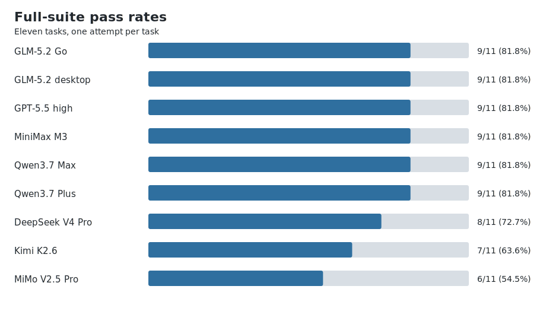

# Private Code Agent Benchmark

A small, reproducible benchmark for evaluating coding agents on software repair
tasks with held-out tests and controlled repository access.

The suite contains ten compact Python tasks, five multi-language repository
tasks, and one repository-scale task based on Click 8.4.0. It is intended for
local comparisons between models, providers, and agent runtimes.

[View benchmark results and reviewed evaluations](evaluation.d/README.md).



## Setup

Requirements:

- macOS for the automated filesystem sandbox
- Python 3.10 or newer
- Git
- Node.js and npm
- Java 21
- .NET 10
- Godot 4.x
- Rust
- a C++20 compiler
- an agent CLI or desktop coding agent

Clone with submodules and initialize the large task:

```bash
git clone --recurse-submodules <repository-url>
cd basic_bench
make setup
make audit
```

If the repository was cloned without submodules:

```bash
git submodule update --init --recursive
python3 scripts/init_large_task.py
```

## Suite

The primary suite has sixteen tasks:

- six compact tasks with basic visible regression tests;
- four compact tasks with no tests visible to the agent;
- five difficult multi-language tasks with no tests visible to the agent;
- one large Click task with no tests visible to the agent.

The large task is generated from the pinned `vendor/click` submodule. It
contains more than 100 files and 20,000 relevant source and documentation
lines.

The multi-language tasks cover React and Vite offline synchronization, a
concurrent Java backend, Godot GDScript and C# persistence, a C++ emulator
memory bus, and a crash-safe Rust WAL queue. Each has five independently
graded requirements worth two points each.

List all tasks:

```bash
python3 bench.py list
```

## Run with any agent CLI

Set `BENCH_AGENT_COMMAND` to a JSON array. The placeholders `{root}`, `{codex}`,
`{workspace}`, and `{prompt}` are replaced for each task.

Example:

```bash
export BENCH_AGENT_COMMAND='[
  "my-agent",
  "--cwd", "{workspace}",
  "--prompt", "{prompt}"
]'
export BENCH_AGENT_LABEL='model-a'

python3 bench.py run-private \
  --provider command \
  --run-id model-a

python3 bench.py run-large \
  --provider command \
  --run-id model-a \
  --agent-timeout 3600
```

`run-large` appends the sixteenth task after the fifteen compact and
multi-language tasks.

If an automated compact-task run is interrupted, rerun the same command with
`--resume`. Saved task IDs are skipped and the missing tasks are appended:

```bash
python3 bench.py run-private \
  --provider command \
  --run-id model-a \
  --resume
```

Agent-specific examples for ZCode and OpenCode are documented in
[docs/providers.md](docs/providers.md).

## Run a desktop agent manually

Prepare the ten compact tasks:

```bash
python3 bench.py prepare-manual-run \
  --run-id model-a-manual
```

Follow the generated `MANUAL_RUN.md` under the run directory. After completing
the ten tasks, add the large task:

```bash
python3 bench.py prepare-large-manual \
  --run-id model-a-manual
```

Complete the generated `LARGE_TASK.md`, then grade in this order:

```bash
python3 bench.py finalize-manual-run \
  --run-id model-a-manual

python3 bench.py finalize-large-manual \
  --run-id model-a-manual
```

## Results

Summarize saved runs:

```bash
python3 bench.py report
```

Compare two runs:

```bash
python3 bench.py compare \
  --run-a model-a \
  --run-b model-b
```

Inspect complete records:

```bash
python3 bench.py show-results --run-id model-a
```

Generated results are ignored by Git. Add reviewed summaries under
`evaluation.d/` when publishing findings.

Published comparisons and per-task timings are indexed in
[evaluation.d/](evaluation.d/README.md).

The tracked machine-readable summary is
[evaluation.d/results.json](evaluation.d/results.json). After adding local raw
results and metadata, regenerate both the summary and chart with:

```bash
make publish-results
```

## Methodology

See [METHODOLOGY.md](METHODOLOGY.md) for scoring, isolation, task construction,
limitations, and reporting guidance.

## Sources and license

Third-party sources and licenses are listed in
[ATTRIBUTION.md](ATTRIBUTION.md). The benchmark harness and original task
material are released under the MIT License.
